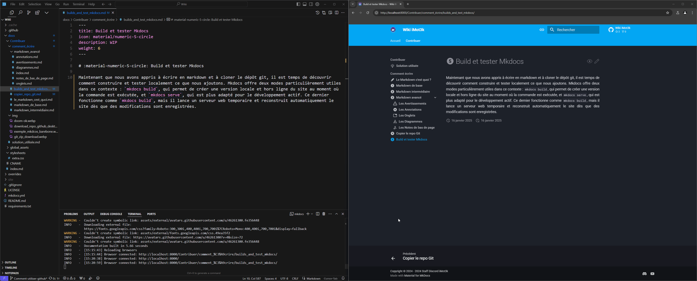

# :material-numeric-5-circle: Build et tester Mkdocs

Maintenant que nous avons appris à écrire en markdown et à cloner le dépôt git, il est temps de découvrir comment construire et tester localement ce que nous ajoutons. Mkdocs offre deux modes particulièrement utiles dans ce contexte : `mkdocs build`, qui permet de créer une version locale et hors ligne du site au moment où la commande est exécutée, et `mkdocs serve`, qui est plus adapté pour le développement actif. Ce dernier fonctionne comme `mkdocs build`, mais il lance un serveur web temporaire et reconstruit automatiquement le site dès que des modifications sont enregistrées.

/// Caption
Exemple live de Mkdcos Serve
///