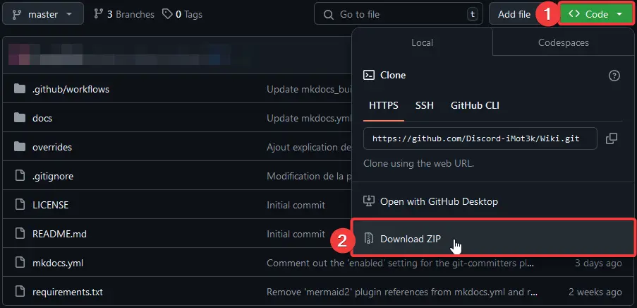
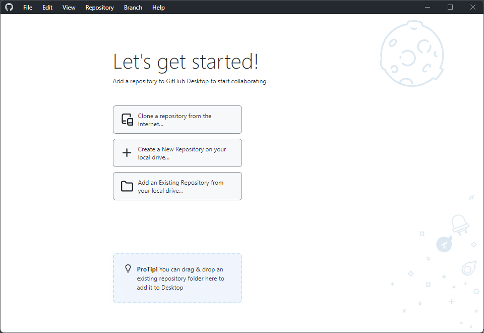

# :material-numeric-4-circle: Copier le repo Github

!!! info "Git n'est pas obligatoire"
    Vous n'êtes absolument pas obligé d'utiliser Git pour contribuer. Il est plus simple de le faire, mais nous sommes ouverts à tous, donc il est également possible de nous soumettre des modifications ou d'autres formats via Discord dans un futur salon dédié.

Nous avons vu comment utiliser le markdown, maintenant il est temps de se plonger dans le téléchargement du dépôt Git. Pour ce faire, il est possible de procéder de plusieurs manières. Nous allons d'abord voir le cas où vous ne voulez pas ou ne pouvez pas utiliser GitHub et Git de manière générale (C'est dommage, vous devriez, c'est la deuxième plus belle chose inventée par [Linus Torvalds](https://fr.wikipedia.org/wiki/Linus_Torvalds) après le noyau Linux 🐧).

Ensuite, nous verrons évidemment comment contribuer en utilisant Git et plus précisément GitHub.

## Téléchargement sans git

Il vous sera obligatoire de télécharger la documentation depuis Github, [ici plus précisément](https://github.com/Discord-iMot3k/wiki). Pour ce faire rien de plus simple vous pouvez télécharger le contenue du repo Git dans un fichier zip.



Le fichier devrait s'appeler tout simplement 
```Text
Wiki-master.zip
```
---

## Téléchargement avec Github Desktop
!!! Tip "Un GUI pour git assez simple"
    GitHub Desktop simplifie l'utilisation de Git avec une interface graphique. C'est un outil pratique et efficace. Vous n'avez pas besoin de compte pour télécharger des dépôts, mais un compte est nécessaire pour les commits.

Pour télécharger un dépôt via GitHub Desktop sans être connecté, suivez ces étapes. Les étapes sont les mêmes, que vous soyez connecté ou non. Cela vous permet de travailler avec le code source sans utiliser la ligne de commande, tout en vous offrant la possibilité de vous connecter pour contribuer activement quand vous le souhaitez.



## Téléchargement avec Git CLI

!!! info "Installer Git"
    Vous pouvez télécharger et installer Git depuis [ce lien](https://git-scm.com/).

Pour cloner le dépôt, utilisez la commande suivante dans votre terminal :

```bash
git clone https://github.com/Discord-iMot3k/wiki
```

### Créer une nouvelle branche

Si vous souhaitez créer une branche différente pour effectuer des tests, utilisez la commande suivante après avoir cloné le dépôt :

```bash
git checkout -b nom-de-votre-branche
```

### Pousser vos modifications

Pour pousser vos modifications sur GitHub, vous devrez vous identifier. Voici comment procéder :

```bash
git add .
git commit -m "Votre message de commit"
git push origin nom-de-votre-branche
```

### Exporter et envoyer votre branche sans GitHub

Si vous ne souhaitez pas utiliser GitHub pour partager vos modifications, vous pouvez exporter votre branche en un fichier zip et l'envoyer sur notre serveur Discord. Voici comment faire :

1. Assurez-vous d'être sur la branche que vous souhaitez exporter :

    ```bash
    git checkout nom-de-votre-branche
    ```

2. Archivez votre branche en un fichier zip :

    ```bash
    git archive -o nom-de-votre-branche.zip HEAD
    ```

3. Envoyez le fichier zip sur notre serveur Discord à l'adresse suivante : [discord.imot3k.fr](https://discord.imot3k.fr).


