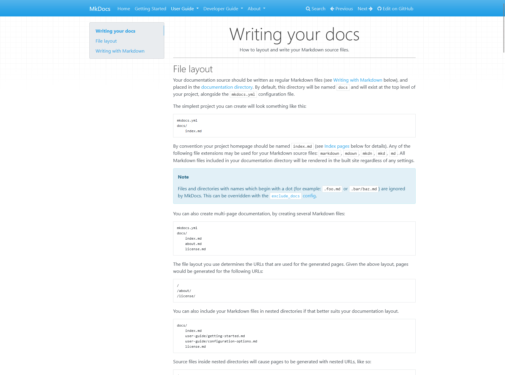

# :material-lightbulb-on-outline: Solution utilisée

On a choisi (~~j'ai en réalité~~) [**MkDocs Material**](https://squidfunk.github.io/mkdocs-material/) pour faire cette documentation. C'est essentiellement parce que c'est open-source et gratuit. Aussi, parce qu'en réalité, MkDocs fonctionne super bien et permet de se focaliser sur le contenu plutôt que le contenant. L'interface est tout de même jolie et fonctionne bien sur mobile comme sur ordinateur, donc que du bénéfice à priori au moment où j'écris ces lignes (4 janvier 2025 🎇)

## Pourquoi j'ai choisi Mkdocs Material ?

Déjà de base MkDocs c'est un truc qui ressemble à ça en barebone : [Documentation Mkdocs](https://www.mkdocs.org/user-guide/writing-your-docs/)

{ width="95%" style="border-radius: 10px;" }
/// caption
Désolé pour l'image en blanc mkdocs est comme ça de base.
///

Donc [Mkdocs](https://github.com/mkdocs/mkdocs/tree/master) est le produit de base, et nous utilisons un thème, plus précisément Mkdocs Material, qui est le thème le plus plébiscité et en réalité le plus abouti. Dans l'ensemble, comme cela permet de se focaliser sur le contenu et non le contenant, on se retrouve avec une belle interface pour un site de documentation.

Pour que tout le monde puisse participer, la base est en Markdown, un langage de balisage très simple, donc même les personnes ne connaissant pas le Markdown peuvent l'apprendre relativement vite (Pas de panique si vous êtes vraiment perdu, nous acceptons de prendre des fichiers Word ou PDF et nous les convertirons pour vous). En plus, ce thème apporte pas mal de fonctionnalités supplémentaires pour rendre la documentation plus lisible et plus agréable à utiliser, rien que la recherche intégrée est un gros plus.

## Alternatives considérées

Bien que MkDocs Material ait été mon choix final, nous avons également envisagé d'autres solutions. Voici quelques-unes des alternatives que nous avons évaluées, ainsi que leurs inconvénients :

=== "Docusaurus"

    | Inconvénient     | Description                                                                                           |
    |------------------|-------------------------------------------------------------------------------------------------------|
    | Complexité       | Docusaurus peut être plus complexe à configurer et à personnaliser, surtout pour les utilisateurs qui ne sont pas familiers avec React. |
    | Dépendances      | Il nécessite une configuration de build plus lourde, ce qui peut être un obstacle pour les projets de documentation plus simples.         |

=== "GitBook"

    | Inconvénient     | Description                                                                                           |
    |------------------|-------------------------------------------------------------------------------------------------------|
    | Coût             | Bien que GitBook offre une version gratuite, les fonctionnalités avancées nécessitent un abonnement payant, ce qui peut être un frein pour les projets à budget limité. |
    | Propriétaire     | GitBook est une solution propriétaire, ce qui limite la flexibilité et le contrôle par rapport à une solution open-source comme MkDocs. |

=== "Read the Docs"

    | Inconvénient              | Description                                                                                   |
    |---------------------------|-----------------------------------------------------------------------------------------------|
    | Personnalisation limitée  | Bien que Read the Docs soit facile à utiliser, il offre moins d'options de personnalisation par rapport à MkDocs Material. |
    | Dépendance à Sphinx       | Il est principalement conçu pour fonctionner avec Sphinx, ce qui peut être un inconvénient pour ceux qui préfèrent Markdown. |

=== "Discord"

    | Inconvénients                | Description                                                                                                           |
    |-----------------------------|---------------------------------------------------------------------------------------------------------------------------|                                                                                                                       
    | Structure informelle        | Discord est principalement une plateforme de communication en temps réel, ce qui rend difficile la structuration et l'organisation de la documentation de manière cohérente et accessible. |
    | Recherche limitée           | Les fonctionnalités de recherche sur Discord sont limitées, ce qui complique la tâche de retrouver des informations spécifiques dans un grand volume de messages. |
    | Pas de versioning           | Contrairement aux systèmes de documentation dédiés, Discord ne permet pas de suivre les modifications ou de gérer les versions de la documentation. |

En conclusion, MkDocs Material s'est avéré être la solution la plus adaptée à nos besoins, offrant un équilibre parfait entre facilité d'utilisation, personnalisation et contrôle. Nous sommes convaincus que cet outil nous permettra de maintenir une documentation de haute qualité pour la communauté.

