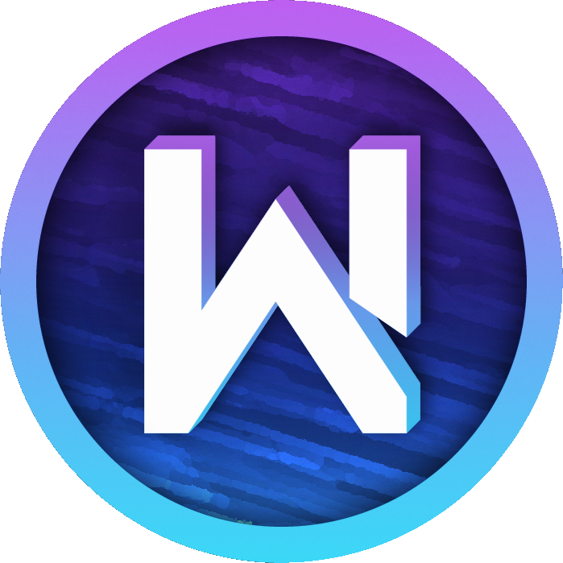

  <h1> Bienvenue sur la documentation Wiki iMot3k !</h1>
  

---

Bienvenue sur le site de documentation officiel de la communauté **iMot3k** ! Nous sommes ravis de vous accueillir et de partager avec vous nos connaissances et nos ressources.

## Qu'est-ce que la communauté iMot3k ?

La communauté **iMot3k** est un espace dédié aux passionnés de technologies, de programmation et d'informatique en général. Notre objectif est de créer un environnement collaboratif où chacun peut apprendre, partager et évoluer.

## Contenu de la documentation

Nous avons organisé la documentation en différentes sections pour faciliter votre navigation :

- **Guides de démarrage** : Des tutoriels pour vous aider à débuter.
- **Références techniques** : Des informations détaillées sur divers sujets technologiques.
- **Projets communautaires** : Découvrez les projets sur lesquels nous travaillons ensemble.
- **Contribuer** : Apprenez comment vous pouvez participer et apporter votre pierre à l'édifice.

!!! tip "Astuce"
    N'hésitez pas à consulter la section **Contribuer** pour savoir comment vous pouvez aider à améliorer cette documentation.

## Rejoignez-nous !

Nous vous invitons à rejoindre notre communauté sur [Discord](https://discord.imot3k.fr) pour échanger avec d'autres membres, poser des questions et participer aux discussions.

**Bonne lecture et bonne exploration !**
